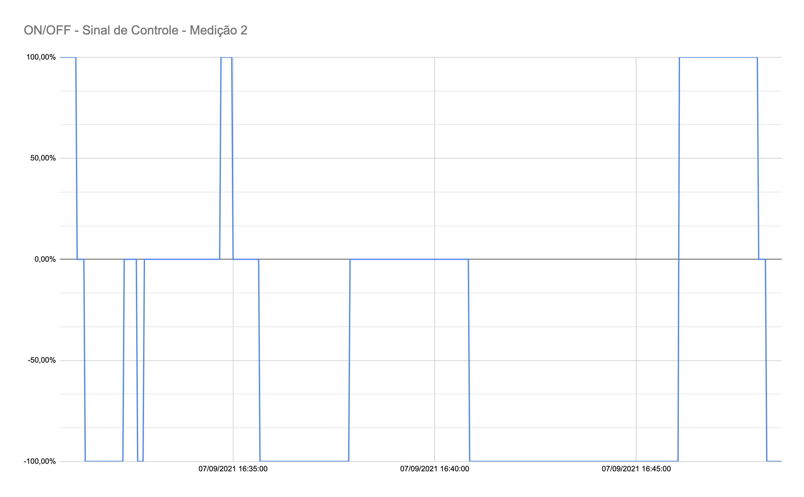

# FSE - Projeto 1

## Aluno

Nome: Daniel Maike Mendes Goncalves

Matrícula: 16/0117003

## Compilação e Uso

- Primeiramente clone esse repositório

```git clone https://github.com/DanMke/FSE-2021.1.git```

- Acesse o diretório **projeto-1**

- No diretório **projeto-1** há um arquivo **Makefile** com os comandos necessários para compilar e executar o programa. 

São eles:

```make all``` ou ```make``` -> Compila os arquivos necessários

```make run``` -> Executa o programa

```make clean``` -> Deleta os binários

### Menu

O programa conta com um simples menu

```
Utilize CTRL+C ou CTRL+Z para finalizar a execução

Selecione uma opção:

(1) On/Off

(2) PID

(3) Utilizar estado da chave externa como controle

(4) Para finalizar
```

Para que o usuário escolha entre os modos de controle On/Off ou PID, ou apenas utilizar o estado da chave externa como controle.

Ao escolher pelo On/Off o usuário poderá escolher o valor da histerese

Ao escolher pelo PID o usuário poderá escolher o valor das constantes Kp (Controle Proporcional), Ki (Controle Integral), Kd (Controle Derivativo)

Por último o usuário escolhe entre utilizar a temperatura de referência através do potenciômetro ou escolher uma temperatura de referência entre a temperatura ambiente e 100 Graus Celsius.

Ao finalizar entre com CTRL+C ou CTRL+Z para que o programa encerre os recursos utilizados e finalize

## Medições

### On/Off

Utilizando Histerese = 4 e Temperatura de Referência através do potenciômetro

#### Medição 1

Arquivo CSV: ./projeto-1/medicoes/project1-on-off.csv


#### Medição 2

Arquivo CSV: ./projeto-1/medicoes/project1-on-off-2.csv




### PID

Utilizando as variáveis:

Kp = 5.0

Ki = 1.0

Kd = 5.0

#### Medição 1

Arquivo CSV: ./projeto-1/medicoes/project1-pid.csv


#### Medição 2

Arquivo CSV: ./projeto-1/medicoes/project1-pid-2.csv


## Referências

[Controle Liga/Desliga - Wikipedia](https://pt.wikipedia.org/wiki/Controle_liga-desliga)  
[Controle PID - Wikipedia](https://pt.wikipedia.org/wiki/Controlador_proporcional_integral_derivativo)  
[Driver da Bosh para o sensor BME280](https://github.com/BoschSensortec/BME280_driver)  
[Biblioteca BCM2835 - GPIO](http://www.airspayce.com/mikem/bcm2835/)  
[Controle do LCD 16x2 em C](http://www.bristolwatch.com/rpi/i2clcd.htm)  
[Biblioteca WiringPi GPIO](http://wiringpi.com)  
[PWM via WiringPi](https://www.electronicwings.com/raspberry-pi/raspberry-pi-pwm-generation-using-python-and-c)

