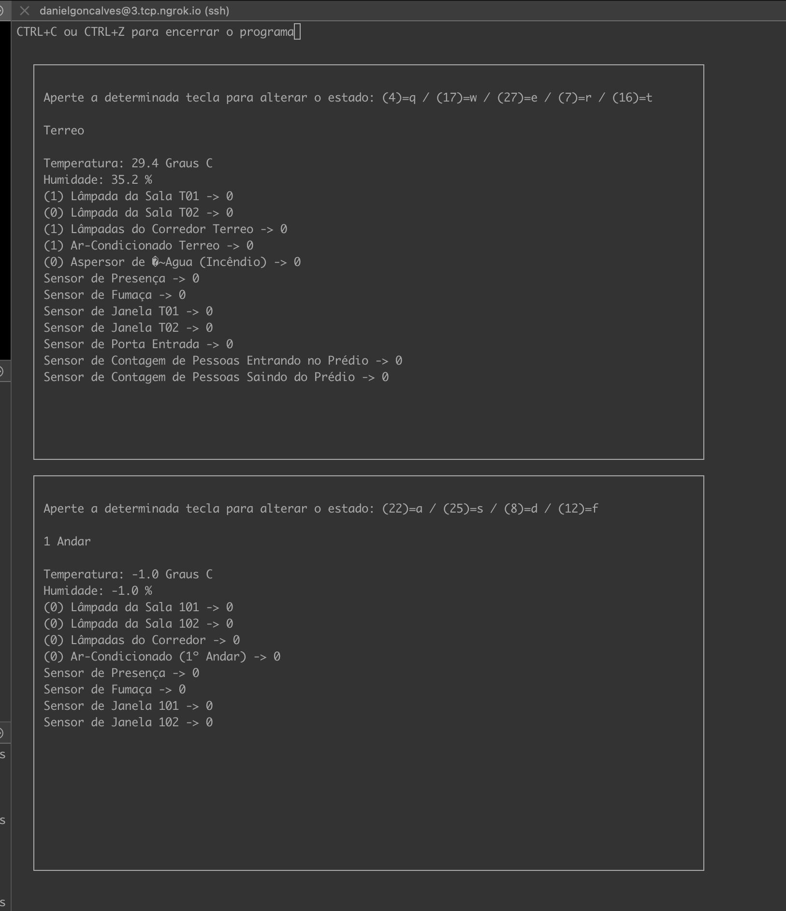

# Projeto 2

## Execução

- Necessário executar primeiro o Servidor Central

### Servidor Central

1 - make

2 - make run

### Servidor Distribuído

1 - make

2 - make run-t (para o terreo)

3 - make run-1 (para o 1 andar)

## Imagem da execução

## Referencias

[Exemplo de uso do DHT22](https://github.com/nebulx29/dht22)

[WiringPi](http://wiringpi.com/)

[cJSON](https://github.com/DaveGamble/cJSON)
